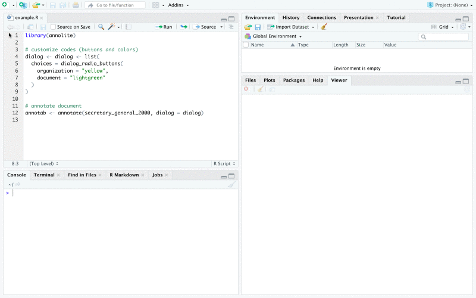

## Purpose

Using large-scale corpora in text-based research often evokes the hope that automated content analysis and "distant reading" [@Moretti2013] will facilitate generalizations that cannot be attained by the close qualitative analysis of a limited number of texts. Yet as supervised machine learning requires training data that needs to be prepared by way of text annotation, the requirement to work with individual texts is not gone. And if we accept the call to "validate, validate, validate" [@Grimmer2013] to reach sound research results, i.e. to corroborate quantitative findings by qualitative means, researchers who have a quantitative take on texts still need tools for inspecting and annotating texts qualitatively.

The requirement to integrate quantitative and qualitative approaches to text is far from new.  Indeed, there is a breadth of tools for text annotation, or for "coding" texts, as it is mostly called in the social sciences. In the context of information science and computational linguistics, server-based solutions such as [brat](https://brat.nlplab.org/), [WebAnno](https://webanno.github.io/webanno/) or [INCEpTION](https://inception-project.github.io/) are powerful tools for complex text annotation tasks. In the social sciences, [ATLAS.ti](https://atlasti.com/) and [MAXQDA](https://www.maxqda.de/) are leaders in the market for the computer-assisted analysis of qualitative data. These are commercial products, to be installed locally, that offer a rich functionality for coding text. So why yet another tool for text analysis?

The open source R package *annolite* offers a lightweight full text display and text annotation toolset designed to be used in combination with RStudio. Its functionality is much more limited than the powerful server-based solutions or the commercial products. But for a set of common, simple and straight-forward text annotation scenarios that have limited technical requirements - if using the computer for text annotation is essentially like working with printed texts using a set of highlighters, possibly writing comments on the margins with a pencil -, *annolite* will offer the functionality that is sufficient. If your annotation task is basic, *annolite* has the advantages that it is open source, easy to install, and designed to be integrated seamlessly into a pure R workflow.

The technical essence of the package is the HTML widget *annolite*. The R functionality of the package exposes the widget (which is written in JavaScript) to R and takes care of the communication and transfer of data between R and JavaScript. A Shiny Gadget wrappted into the `annotate()` function can be used to annotate a text document within the RStudio environment. The gadget returns a `annotationstable` object which can be processed within R. Furthermore, *annolite*  fosters the transperency of the research process. The *annolite* htmlwidget can be used to embed the full text display of an annotated text in the analysis or the research report you write as an R Markdown document. Compared to existing tools for text annotation, the added value of *annolite* is that you have a seamless integration of simple text annotation tasks into a pure R workflow. It supports maximum transparency on text annotation by providing functionality to embed texts and annotations in a html document written in R Markdown.

There are two different uses of the `annolite` [htmlwidget](https://www.htmlwidgets.org/):

1. **Annotation Mode:** It can be used to create highlighter & pencil-style annotations. This scenario requires usage of the *annolite*-htmlwidget in an interactive environment. The package includes a [Shiny Gadget](https://shiny.rstudio.com/articles/gadgets.html) included the `annotate()`-function. When finishing the annotation of a document, the gadget returns an `annotationstable` object to be processed in the R session.

2. **Display Mode:** The `annolite` htmlwidget can be used to inspect a document and its annotations. The htmlwidget will (a) reconstruct the full text, (b) highlight tokens that have been annotated using the color that has been designated for a code and (c) include tooltips with the comment that has been written on an annotation. The HTML widget can be displayed as a HTML page generated in the R session (using RStudio's Viewer pane if you use the IDE), and it can be included in HTML documents generated from R Markdown. A special feature is that the *annolite*  HTML widget is crosstalk-enabled. This feature is the basis that one HTML element can include a filter and a *annolite* widget to report the annotations of multiple documents. 


## Installation and getting started

The *annolite* package is a GitHub-only package at this stage. You can install it from the GitHub presence of the PolMine Project as follows:

```{r install_annolite_github_master, eval = FALSE}
remotes::install_github("PolMine/annolite")
```

To install the development version of *annolite*, install the package from the *dev* branch of the repository.

```{r install_annolite_github_dev, eval = FALSE}
remotes::install_github("PolMine/annolite", ref = "dev")
```

To check whether *annolite* has been installed succesfully, load it in you R session. 

```{r load_annolite, eval = TRUE}
library(annolite)
```

There are no default startup messages of *annolite*. Yet note that several other packages define an `annotate()` method or function; this may trigger a message that objects are masked when *annolite*  is attached. Most importantly, if you rely on the **NLP** package and have loaded it before loading *annolite*, you might see the message "The following object is masked from ‘package:NLP’: annotate". In this case, prepend the package name followed by two colons to use the `annotate()` method of the *annolite* package, i.e. call `annolite::annotate()`.


## Data structures 

The package defines two different core classes to represent the full text of a document and associated annotations. 


### The `fulltexttable` class

The S3 class `fulltexttable` is a `data.frame` with information on the content and the formatting of the chunks of text that make up a document. A `fulltexttable` can be generated from several kinds of text input using the constructor method `fulltexttable()` and is designed to transfer data seamlessly to JavaScript.

The rows of a `fulltexttable` are the chunks of text that make up a text documment. Each chunk is defined by the following columns of the table:

- *name*: A `character` vector, serves as an identifier to distinguish the content of different documents. Defaults to "", but required to be defined when different documents are to be combined in one `fulltexttable` and crosstalk is used to filter, or to select documents for display.

- **element**: A `character` vector defining the HTML element that will define the layout chunks of text (e.g. "h1" for level 1 headline, "p" or "para" for plain paragraphs). 

- *style*: Content of the style attribute of the element. Used at this stage to set the display mode. Defaults to "block" (chunk is displayed), but needs to be "display:none" when crossstalk is used to filter documents, or to make selections.

- *tokenstream*: A list of three-column `data.frame` objects that are nested into the cells of the `fulltexttable`. The HTML for full text display will be generated from this data upon calling the *annolite* HTML widget. Keeping the full text data in the nested `data.frame` ensures that data remains accessible and can be changed.

The `fulltexttable()` method serves as a the constructor for the `fulltexttable` class. It is designed to facilitate working with *annolite* offering flexibility to process different kinds of data. The method accepts different inputs. The most elementary input is a list of character vectors. 

Jane Austen's novel *Emma* is a popular text for teaching text analysis with R. It is part of the R package [janeaustenr](https://CRAN.R-project.org/package=janeaustenr) as well as the examples used for the tidy approach to text mining (cp. [Julia Silge and David Robinson's book Text Mining with R](https://www.tidytextmining.com/)). This *annolite* package includes the first five chapters of the book as sample data. It is list of the chapters of *Emma* that are lists of character vectors representing tokenized paragraphs. The data looks as follows.

```{r emma_first_paragraph}
emma_chapters_tokenized[[1]][[1]]
```

To turn the first chapter of Emma into a `fulltexttable`, supply the `fulltexttable()` method with the list of character vectors with the tokenized paragraphs (of chapter one in this example) as input.

```{r}
emma_ch1 <- fulltexttable(emma_chapters_tokenized[[1]])
```

The object `emma_ch1` is the list of chunks introduced before. To illustrate, we inspect the first chunk. 

```{r}
emma_ch1[1,]
```

Having the `fulltexttable` object is enough to generate our first *annolite* HTML widget:

```{r}
annolite(emma_ch1)
```

To learn more about the using the `fulltexttable()` method, consult the documentation (`?fulltexttable`).

The functionality to include full text based on the `fulltexttable` class in an R Markdown may be all you need at times. But *annolite* is about annotating text. The `annotationstable` class is a complementary data structure to manage annotations.


### The `annotationstable` class

The `annotationstable` class is a S3 superclass of a `data.frame`. It is and behaves like a `data.frame`, but defining the class is useful for being able to define specified methods. An `annotationsstable` has the columns "text", "code", "color", "annotation", "start" and "end". This captures all the information generated when annotating a document using *annolite*.  

To convey what a `annotationstable` looks like, inspect the `secretary_general_2000_annotations` object that is included as sample annotation in the package.

```{r}
head(secretary_general_2000_annotations)
```

Note that what you see in the column "text" is the text selection when creating an annotation; it does not necessarily cover entire words. The token ids in this table are fairly high numbers because Kofi Annan's speech is part of the UN General Assembly corpus - it is a fairly small subset of a much larger corpus.

To learn more about the `annotationstable`, see the documentation of the `annotationstable()` function (`?annotationstable`) that serves as a constructor of an (empty) `annotationstable`.


## Annotation Mode

To annotate text documents using *annolite*, the package includes a Shiny Gadget that has the `annolite` htmlwidget at its core. The gadget is called using the function `annotate()`. It requires a `fulltexttable` of the document to be annotated or any kind of object that can be transformed to a `fulltexttable` as input.

If annotations have already been made, supply the respective `annotationstable` as argument `annotations`. The gadget is designed to be used in an interactive RStudio session. It will be run in the Viewer pane of RStudio and the `annotationstable` with your (new) annotations will be returned when the gadget is closed.

To customize buttons that will show in a pop-up window to make an annotation when you have selected text, you use named list, see the following code.

```{r,eval = FALSE}
annotab <- annotate(
  secretary_general_2000_speech,
  secretary_general_2000_annotations,
  buttons = list(vision = "green", dystopia = "pink")
)
```

It is not possible to embed a Shiny Gadget into a standalone HTML document. The following "movie" conveys a sense of the annotation process.



## Display Mode

Whatever tool is used for annotating documents: Creating annotations requires theoretical guidance, reflection and time. Annotations are a valuable research resource. Making documents and their annotations accessible for inspection, for evaluation and critique is important for transparency and quality control. The display mode of the *annolite* htmlwidget serves this purpose.

To use annolite for displaying documents with annotations, you supply the document as a `fulltexttable`, you do not define buttons for the interactive annotation part (argument `buttons` is NULL), and you pass an `annotationstable` to the *annolite* widget via the `annotations` argument.

The code to create an *annolite* HTML widget and the resulting HTML can be embedded in R Markdown documents (including slides) easily. You can pass the HTML document by mail or put it online (e.g. via GitHub Pages). Presumably, everybody will have a browse that will be able to process the HTML documents you generate. Barriers for creating maximum transparency on your research are minimal:

* Nobody will have to install a server to inspect and check the annotations you and your team made.
* It is not necessary to acquire access to proprietary software before your annotations can be inspected.

The package includes a minimal dataset with annotations on the speech of UN Secretary-General Kofi Annan on the occassion of the Millenium Summit (object `secretary_general_2000_annotations`). This is how you create the htmlwidget and include it in the document.

```{r, eval = TRUE}
annolite(
  secretary_general_2000_speech,
  annotations = secretary_general_2000_annotations
)
```


### Inspecting multiple annotated documents

Usually, a set of documents will be annotated. It would be quite tedious to include HTML widgets for all annotated document manually in your research report. Yet you can combine multiple HTML widgets into one browsable HTML element that can communicate with each other via a mechanism introduced with the [crosstalk](https://CRAN.R-project.org/package=crosstalk) package. The *annolite* HTML widget is crosstalk-enabled and provides the possibility to inspect multiple annotated documents in one HTML element.

The `annolite()` method will prepare a HTML element with a filter menu and a *annolite* full text display part if it finds more than one unique identifier in the column "name" if the input `fulltexttable`.

We use the chapters of Emma as an example and start with preparing the list of `fulltexttable` objects. Each of these objects in the list will include the full text of a chapter.

```{r, eval = TRUE}
emma_chapters <- lapply(emma_chapters_tokenized, fulltexttable)
```

To assign name identifiers to the chunks making up a chapter, we iterate through the chapters again and fill the column "name".

```{r}
emma_chapters <- lapply(
  seq_along(emma_chapters),
  function(i){
    emma_chapters[[i]][["name"]] <- sprintf("Chapter %s", i)
    emma_chapters[[i]]
  }
)
```

This is all that is required to generate a HTML element with text selection functionality.

```{r, eval = TRUE}
annolite(do.call(rbind, emma_chapters), group = "emma", buttons = FALSE)
```

Note that we need to define a crosstalk group ("emma") here. There is another HTML element using crosstalk below and we need to ensure that communications do not get mixed up between elements.

## Further uses and abuses of annolite

### Evaluating Topic Models

The original intention of *annolite* is to offer a lightweight open source tool for a pure R workflow to create and display annotations. The widget is open for alternative uses and may be appropriate whenever you want to highlight sequences of text in documents.

For instance, the display mode of the *annolite* widget can be used to qualitatively evaluate topic models. In Blei's review topic models, there is a very informative snippet of a text highlighting the words that indicate three different topics [@Blei2012, p. 78].

The *annolite* widget can get you this kind of output which may be very useful to evaluate topic models. In the example we use to exemplify this usage, a topic model (k = 180) is computed for the speeches in the United Nations General Assembly. Topic 105 might be indicative for a thematic focus on international migration. To evaluate this preliminary association, the following HTML element can be used - you can skip through the speeches that went into the computation of the topic model, the terms indicative for topic 105 (first 50 terms only) are highlighted in yellow. Note that to maintain a reasonable size of the vignette, only 10 documents are included here.


```{r}
annolite(
  x = unga_migrationspeeches_fulltext,
  annotations = unga_migrationspeeches_anntationstable,
  group = "unga"
)
```

To limit the number of dependencies, to avoid having to download somewhat large data when preparing the vignette, and to limit computation time, the objects `unga_migrationspeeches_fulltext` and `unga_migrationspeeches_anntationstable` are included as sample data in the package.


### Using the document viewer in slides

Including an `annolite` htmlwidget as such, or an HTML element that integrates it into a HTML presentation may help a lot to explain or document research. However, generating a an ioslides presentation from R Markdown [@XieAllaireGrolemund2018], which is flexible and comfortable in general, may entail awkward CSS conflicts when trying to include an `annolite` htmlwidget. The best practice we could identify is to wrap the HTML element that includes an `annolite` htmlwidget into a "widgetframe", an approach introduced with the [widgetframe](https://CRAN.R-project.org/package=widgetframe) package. Technically, the htmlwidget will be put into an iframe, thus containing it and avoiding CSS conflicts.

A template for creating slides included in the package provides further explanations and includes the relevant code. The template is available from RStudio via the menu: File > New File > R Markdown > From Template > slides {annolite}.


## Implementation and technical remarks

The implementation of the annolite htmlwidget interprets the original intentions of the authors of htmlwidgets and the crosstalk functionality quite freely in two respects:

* The original intention of *htmlwidgets* is to provide "a framework for creating R bindings to JavaScript libraries" (see [https://www.htmlwidgets.org/develop_intro.html](see developers' guide for creating HTML widgets)). The JavaScript code of htmlwidgets is usually a binding for the existing underlying JavaScript library. In the case of *annolite*, the JavaScript code has been written exclusively for the annolite package. This is not what most htmlwidgets do, but it does not involve dirty hacks. It is possible in a straightforward manner.

* It is not as straightforward that the *annolite*  HTML widget is crosstalk-enabled: Crosstalk is designed to work with data frames, or data frame-like objects (see [https://rstudio.github.io/crosstalk/authoring.html](guide to authoring crosstalk-enabled widgets)). In fact, to exemplify which kinds of data are not suited for crosstalk, the documentation mentions corpora. The authors might be surprised how *annolite* uses crosstalk to selectively display corpora. But at the bottom line, nesting a list of `data.frame` object with the data on the full text in the `data.frame` with metadata and information for HTML layout is quite in line with the instructions for data crosstalk is compatible with. And it works smoothly.

* There is a mixture of the S3 and the S4 systems of object-oriented programming within the package: The S4 method `fulltexttable()` is the constructor for the S3 `fulltexttable` class. This hybrid state of affairs has one great advantage: The S3 `fulltexttable` class can be converted to a JSON string that is passed to JavaScript directly, whereas some intermediate data transformation would be necessary if the `fulltexttable` was an S4 class. Hopefully it will ease the irritation of users being aware of this background.


## Next Steps

For complex annotation tasks: INcePTION


## References
